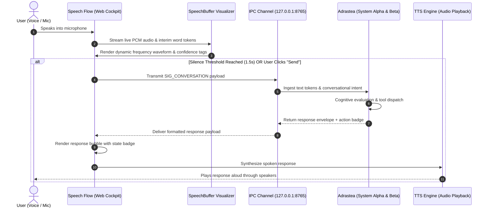

# Speech Flow

<p align="center">
  <a href="https://www.python.org/"></a>
  <a href="#core-features"></a>
  <a href="#architecture--interaction-loop"></a>
  <a href="LICENSE"></a>
  <a href="CONTRIBUTING.md"></a>
  <a href="https://github.com/holman57/speech-flow/stargazers"></a>
</p>

**Speech Flow** is a real-time conversational voice interface and audio stream visualizer. It interprets rolling speech buffers from microphone input, dynamically renders audio frequency spectrums and token confidence streams, dispatches structured conversational utterances to **Adrastea**, and narrates cognitive decisions aloud via low-latency Text-to-Speech (TTS).

> [!TIP]
> **Voice Cockpit**: Speech Flow acts as the multimodal voice layer for autonomous agent architectures like Adrastea, enabling zero-lag verbal directives, live WPM telemetry, and hands-free desktop/mobile control over local networks and Tailscale.

---

## Table of Contents

- [Architecture & Interaction Loop](#architecture--interaction-loop)
- [Core Features](#core-features)
- [System Comparison: Speech Flow vs Native Voice](#system-comparison)
- [Quick Start](#quick-start)
- [CLI Reference](#cli-reference)
- [Mobile & Tailscale Access](#mobile--tailscale-access)
- [Contributing](#contributing)
- [Show Your Support](#show-your-support)
- [License](#license)

---

## Architecture & Interaction Loop



---

## Core Features

- 🌊 **Real-Time Waveform & Buffer Visualizer**:
  - Live Web Audio API frequency analysis pulsing smoothly with microphone input gain.
  - Interactive rolling word token display distinguishing between active speech hypotheses and committed word tokens.
  - Continuous telemetry: Real-time Words-Per-Minute (WPM), RMS audio volume, and token counts.
- ⚡ **Bidirectional IPC with Adrastea**:
  - Connects directly to Adrastea's low-latency TCP socket (`127.0.0.1:8765`).
  - Supports conversational directives (e.g. *"Adrastea, check system health"*, *"Wake up"*, *"Go to sleep"*, *"Run diagnostics"*).
  - Receives rich decision envelopes containing action badges, execution statuses, and voice responses.
- 🔊 **Dual-Engine Text-To-Speech (TTS)**:
  - **Browser Web Speech API**: Client-side, zero-lag voice playback for desktop and mobile browsers.
  - **Native Windows SAPI Engine**: High-fidelity local voice synthesis via `win32com.client` for headless or desktop automation.
- 📱 **Mobile & Headless Responsive**:
  - Full-screen responsive viewport designed for smartphones (iOS Safari & Android Chrome).
  - Effortless secure remote access across mesh networks (e.g., Tailscale).

---

## System Comparison

| Capability | Standard Web Speech | Speech Flow Cockpit |
| :--- | :---: | :---: |
| **Streaming Hypothesis Visualization** | ❌ No | ✅ Real-time token highlighting |
| **Live WPM & Audio Telemetry** | ❌ No | ✅ Real-time WPM + Volume Meter |
| **Agent IPC Integration** | ❌ No | ✅ Native `SIG_CONVERSATION` TCP socket |
| **Mobile Mesh Access (Tailscale)** | ❌ Difficult | ✅ Built-in responsive web serving |
| **Dual TTS Synthesis (Client & Local SAPI)**| ❌ Client only | ✅ Hybrid browser + native fallback |

---

## Quick Start

### Prerequisites
1. **Python 3.10+**
2. Ensure **Adrastea** is running in keep-alive mode:
   ```powershell
   cd C:\Users\LukeH\Adrastea
   python -m adrastea.cli keepalive
   ```

### 1. Launch Speech Flow Server
```powershell
cd C:\Users\LukeH\speech-flow
python -m speech_flow.cli serve --port 7860
```

### 2. Access the Voice Cockpit
- **Local Machine**: Open [`http://127.0.0.1:7860`](http://127.0.0.1:7860) in Chrome, Edge, or Safari.
- Click **"Start Listening"** and grant microphone permissions.
- Speak naturally; watch your words stream into the visualizer and hear Adrastea's answers spoken back.

---

## CLI Reference

### Serve Web Interface
```powershell
python -m speech_flow.cli serve --host 0.0.0.0 --port 7860
```

### Headless Verification Test
Simulate a full round-trip voice query without opening a browser:
```powershell
python -m speech_flow.cli test --text "Adrastea, report your current operational status."
```

---

## Mobile & Tailscale Access

Access the full voice cockpit from your smartphone over Tailscale:
1. Ensure Tailscale is running on both host PC and mobile phone.
2. Launch Speech Flow bound to `0.0.0.0`:
   ```powershell
   python -m speech_flow.cli serve --host 0.0.0.0 --port 7860
   ```
3. Navigate to `http://<your-tailscale-ip>:7860` on mobile Safari or Chrome.

---

## Contributing

Contributions to audio DSP algorithms, noise-cancellation filtering, and UI visualizations are welcomed!

1. Fork the repo (`gh repo fork holman57/speech-flow`).
2. Create a feature branch (`git checkout -b feat/vad-silence-detector`).
3. Commit your changes (`git commit -m 'feat: implement WebAudio VAD energy detector'`).
4. Push and open a Pull Request.

See [CONTRIBUTING.md](CONTRIBUTING.md) for full development standards.

---

## Show Your Support

If you enjoy Speech Flow, please give it a **⭐ Star** and **🍴 Fork** the repo to help other developers build voice-enabled AI agents!

---

## License

This project is licensed under the [MIT License](LICENSE).
