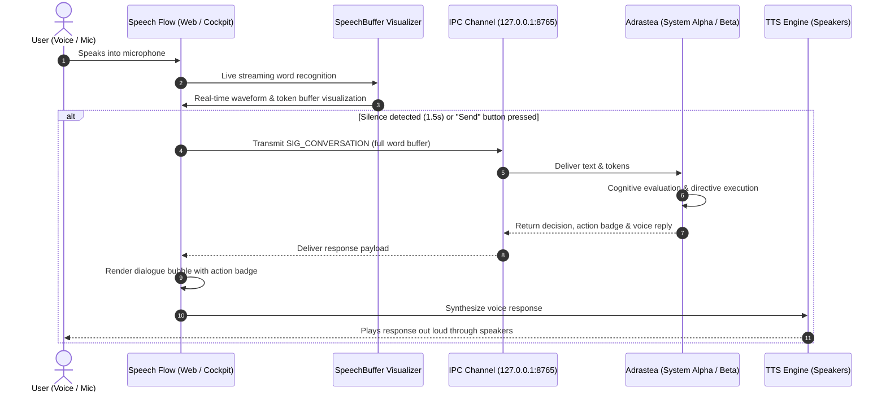

# Speech Flow

**Speech Flow** is a high-performance, real-time voice and speech orchestration framework designed for seamless bi-directional voice interaction, audio stream processing, speech-to-text transcription, and conversational agent execution.

---

## Overview

**Speech Flow** is a real-time conversational voice interface that visualizes rolling speech buffers interpreted from microphone input, dispatches structured utterances to **Adrastea**, and plays Adrastea's cognitive decisions aloud via Text-to-Speech (TTS).

---

## Architecture & Interaction Loop



---

## Core Features

- **Real-Time Word Buffer Visualizer**:
  - Live audio frequency and waveform spectrum pulsing with microphone input.
  - Interactive rolling word buffer displaying recognized words with confidence and timestamps.
  - Highlighting of interim speech hypotheses versus finalized word tokens.
  - Telemetry: Live Words-Per-Minute (WPM), audio volume level, and word count.
- **Bidirectional Interface with Adrastea**:
  - Communicates directly with Adrastea's `127.0.0.1:8765` IPC socket using `SIG_CONVERSATION`.
  - Adrastea's decision engine automatically routes commands (e.g. *"What is your status?"*, *"Wake up"*, *"Go to sleep"*, *"Run system diagnostics"*) or general conversation through its cognitive LLM engine.
- **Natural Text-To-Speech (TTS)**:
  - Browser SpeechSynthesis for zero-lag playback on desktop and mobile browsers.
  - Native Windows SAPI voice (`win32com.client`) for desktop and headless execution.
- **Mobile & Desktop Responsive**:
  - Fully functional on phone browsers (Safari / Chrome) over Tailscale (`http://100.112.85.87:7860`) or local Wi-Fi.

---

## Quick Start

### 1. Launch Adrastea
Ensure Adrastea is running so its IPC socket is open:
```powershell
cd C:\Users\LukeH\Adrastea
python -m adrastea.cli keepalive
```

### 2. Launch Speech Flow
```powershell
cd C:\Users\LukeH\speech-flow
python -m speech_flow.cli serve --port 7860
```

Open your browser to **`http://127.0.0.1:7860`** (or access from your phone over Tailscale at **`http://100.112.85.87:7860`**).

### 3. Verification & CLI Test
To test the roundtrip without opening a browser:
```powershell
python -m speech_flow.cli test --text "Adrastea, what is your current system status?"
```

---

## License

This project is licensed under the MIT License - see the [LICENSE](LICENSE) file for details.
